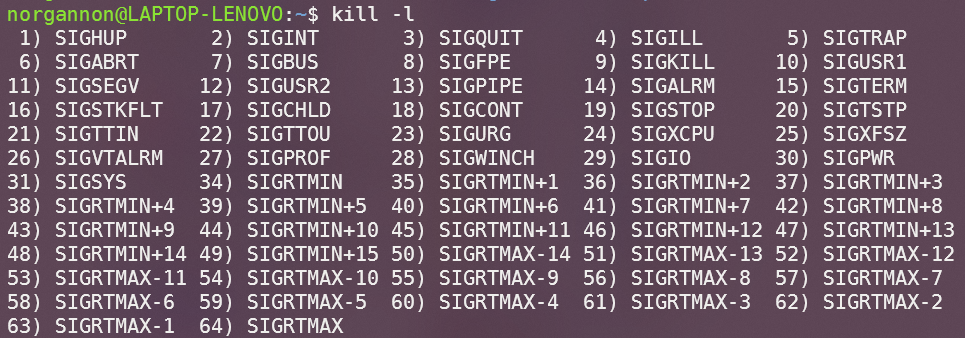

# Lab06: 信号及信号处理

[TOC]

## 1. 实验目的

- 掌握信号基本概念。
- 学习屏蔽、捕获信号的方法等与信号有关的基本操作。
- 理解可重入函数、异步信号安全函数的概念。

## 2. 实验内容

- 信号的含义
- 信号的分类
- 信号的产生
- 信号捕获
- 信号的屏蔽

## 3. 实验指南

### 3.1. 信号

**详见人民邮电出版社《Linux 编程基础》第 6 章**

#### 3.1.1. 信号的含义

软中断信号(signal，又简称为信号)用来通知进程发生了异步事件。在软件层次上是对中断机制的一种模拟，在原理上，一个进程收到一个信号与处理器收到一个中断请求可以说是一样的。信号是进程间通信机制中唯一的异步通信机制，一个进程不必通过任何操作来等待信号的到达，事实上，进程也不知道信号到底什么时候到达。进程之间可 以互相通过系统调用 kill 发送软中断信号。内核也可以因为内部事件而给进程发送信号，通知进程发生了某个事件。信号机制除了基本通知功能外，还可以传递附加信息。

#### 3.1.2. 信号的分类

可以使用`kill -l`命令查看当前系统支持的所有信号：



信号值小于 SIGRTMIN（<=34）的信号都是不可靠信号。它的主要问题是信号可能丢失。 信号值位于 SIGRTMIN 和 SIGRTMAX 之间的信号都是可靠信号，这些信号支持排队，不会丢失。

#### 3.1.3. 信号的产生

- 键盘事件：ctrl+c ctrl+\ ctrl+Z 等

- 非法内存：如果内存管理出错，系统就会发送一个信号进行处理

- 硬件检测到异常：如段错误，除 0，总线错误等

- 环境切换：比如说从用户态切换到其他态，状态的改变也会发送一个信号，这个信号会告知给系统

- 系统调用：如调用`kill`，`raise`，`sigsend` ，`sigqueue`函数等，这些函数的使用具体请参见《Linux 编程基础》的 6.1 节。

#### 3.1.4. 信号处理

进程可以通过三种方式响应信号：

- 接受默认处理
- 忽略信号（某些信号不能被忽略，如 SIGKILL 和 SIGSTOP）
- 捕捉信号并执行信号处理程序

### 3.2. 信号操作

#### 3.2.1. 信号的发送

- kill()函数

  系统调用中用于发送信号的函数有 kill(), raise(), abort() 等，其中 kill()是最常用的函数，该函数用于给指定进程发送信号，该函数的声明如下：

  ```c
  #include <signal.h>

  int kill(pid_t pid, int sig);
  //第一个参数pid代表接受信号的进程PID，第二个参数代表要发送的信号
  ```

  参数 pid 会影响 kill()函数的作用，取值分为以下四种情况

  1. 若 pid>0，则发送信号 sig 给进程号为 pid 的进程。

  2. 若 pid=0，则发送信号 sig 给当前进程所属进程组的所有进程。

  3. 若 pid=-1，则发送信号 sig 给除 1 号进程和当前进程外的所有进程。

  4. 若 pid<-1，则发送信号 sig 给属于进程组 pid 的所有进程。

- sigqueue() 函数

  sigqueue() 函数同样用于发送信号，与 kill() 不同的是，sigqueue()函数支持发送信号的同时传递参数，需要配合 sigaction()函数一起使用。sigqueue() 函数的声明如下：

  ```c
  #include <signal.h>
  
  int sigqueue(pid_t pid, int sig, const union sigval value);
  //第一个参数pid代表接受信号的进程PID，第二个参数代表要发送的信号，第三个参数用于指定传递的数据
  ```

  参数 value 用于指定伴随信号传递的数据，为 sigval 联合体，该联合体的定义如下：

  ```c
  union sigval {
    int   sival_int;
    void *sival_ptr;
  };
  ```

  如果进程需要接收信号和附加数据，定义信号处理函数时首先应该接收三个参数：

  ```c
  void handler(int sig, siginfo_t *info, void *ucontext)
  {
    ...
  }
  // 第一个参数sig代表接收信号的值
  // 第二个参数info是指向siginfo_t类型的指针，包含了有关信号的附加信息
  // 第三个参数ucontext是内核保存在用户空间的信号上下文，一般不使用该参数
  ```

  此时如果接收进程使用 sigaction() 注册信号处理函数，并将 sa_flags 字段置为 SA_SIGINFO，那么在信号处理函数中可以通过 info 参数的`si_value`获取到发送信号伴随的数据，如`info->si_value.sival_int`或`info->si_value.sival_ptr`。

 具体可以参考 [sigqueue(3) — Linux manual page](https://man7.org/linux/man-pages/man3/sigqueue.3.html) 和 [sigaction(2) — Linux manual page](https://man7.org/linux/man-pages/man2/sigaction.2.html)。

#### 3.2.2. 信号的捕捉

若进程捕捉某信号后，想要让其执行非默认的处理函数，则需要为该信号注册信号处理函数。进程的信号是在内核态下处理的，内核为每个进程准备了一个信号向量表，其中记录了每个信号所对应的信号处理函数。Linux 系统为用户提供了两个捕捉信号的函数，即 `signal()` 和 `sigaction()` 两个函数。

```c
#include <signal.h>

typedef void (*sighandler_t)(int);
sighandler_t signal(int signum,sighandler_t handler);

//第一个参数表示信号编号，第二个参数一般表示信号处理函数的函数指针，除此之外还可以为SIG_IGN和SIG_DEL
```

```c
#include <signal.h>

int sigaction(int signum,const struct sigaction* act,const struct sigaction* oldact);

//第一个参数表示信号编号，第二个为传入参数，包含自定义处理函数和其他信息，第三个参数为传出参数，包含旧处理函数等信息
```

#### 3.2.3. 信号的屏蔽

信号屏蔽机制是用于解决常规信号不可靠这一问题。在进程的 PCB 中存在两个信号集，分别为信号掩码和未决信号集。两个信号集实质上都是位图，其中每一位对应一个信号，若信号掩码某一位为 1，则其对应的信号会被屏蔽，进入阻塞状态，此时内核会修改未决信号集中该信号对应的位为 1，表示信号处于未决状态，之后除非信号被解除屏蔽，否则内核不会再向该进程发送该信号。

信号集设定函数：

- `sigemptyset()`——将指定信号集清 0

- `sigfillset()`——将指定信号集置 1

- `sigaddset()`——将某信号加入指定信号集

- `sigdelset()`——将某信号从信号集中删除

- `sigismember()`——判断某信号是否已被加入指定信号集

信号集函数：

```c
#include <signal.h>

int sigprocmask(int how,const sigset_t* set,sigset_t* oldset);

//第一个参数用于设置位操作方式，第二个参数一般为用户指定信号集，第三个参数用于保存原信号集
//how=SIG_BLOCK：mask=mask|set
//how=SIG_UNBLOCK：mask=mask&~set
//how=SIG_SETMASK：mask=set
```

#### 3.2.4. 定时信号

Linux 下的 `alarm()` 函数可以用来设置闹钟，该函数的原型为：

```c
#include<unistd.h>
unsigned int alarm(unsigned int seconds);
//第一个参数seconds用来指明时间，经过seconds秒后发送SIGALRM信号给当前进程，当参数为0则取消之前的闹钟
```

返回值：

- 如果本次调用前已有正在运行的闹钟，alarm()函数返回前一个闹钟的剩余秒数
- 如果本次调用前无正在运行的闹钟，alarm()函数返回 0

Linux 系统中 sleep()函数内部使用 nanosleep()函数实现，该函数与信号无关；而其他系统中可能使用 alarm()和 pause()函数实现，此时不应该混用 alarm()和 sleep()。

#### 3.2.5. 计时器

Linux 下的 `setitimer()` 和 `getitimer()` 系统调用可以用于访问和设置计时器，计时器在初次经过设定的时间后发出信号，也可以设置为每间隔相同的时间发出信号，该函数的原型为：

```c
#include <sys/time.h>

int getitimer(int which, struct itimerval *curr_value);
int setitimer(int which, const struct itimerval *restrict new_value,
                     struct itimerval *restrict old_value);
```

通过指定 which 参数，可以设置不同的计时器，不同的计时器触发后也会发出不同的信号，一个进程同时只能有一种计时器：

- ITIMER_REAL：真实计时器，计算程序运行的真实时间（墙钟时间），产生 SIGALRM 信号
- ITIMER_VIRTUAL：虚拟计时器，计算当前进程处于用户态的 cpu 时间，产生 SIGVTALRM 信号
- ITIMER_PROF：使用计时器，计算当前进程处于用户态和内核态的 cpu 时间，产生 SIGPROF 信号

计时器的值有以下结构体定义：

```c
struct itimerval {
  struct timeval it_interval; //定期触发的间隔
  struct timeval it_value; //初次触发时间
};

struct timeval {
  time_t tv_sec; //秒
  suseconds_t tv_usec; //微秒
};
```

若 new_value.it_value 的两个字段不全为 0，则定时器初次将会在设定的时间后触发；若 new_value.it_value 的两个字段全为 0，则计时器不工作。

若 new_value.it_interval 的两个字段不全为 0，则定时器将会在初次触发后按设定的时间间隔触发；若 new_value.it_interval 的两个字段全为 0，则计时器仅初次触发一次。

setitimer()函数和 alarm()函数共享同一个计时器，因此不应同时使用。

## 4. 实验习题

- 见Assignment文件
- 实验提交Assignment导出的pdf文件即可。
