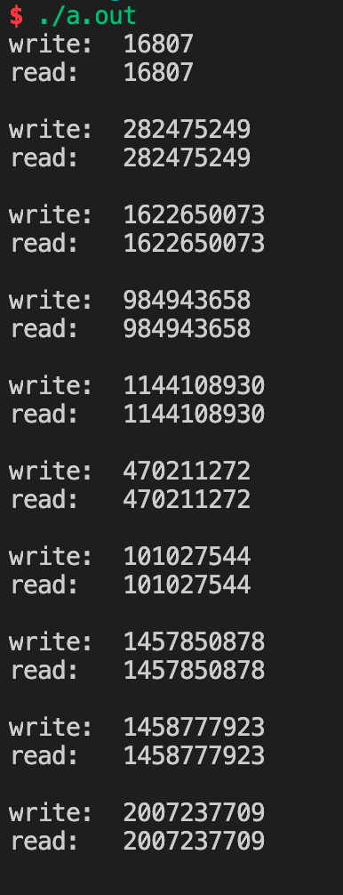

# Lab07 Assignment

> 班级：202111
>
> 学号：19241027
>
> 姓名：胡峻诚

## 1. 请实现这样一个程序

请实现这样一个程序：客户端进程（Client）和服务器进程（Server）通过**消息队列**进行通信，消息队列共有两个，Up 和 Down，如下图所示：


客户端进程接受用户从终端的输入，并通过 Up 消息队列将消息传递给服务器进程，然后等待服务器进程从 Down 消息队列传回消息。服务器进程从 Up 接收到消息后**将大小写字母转换**，并通过 Down 传回给客户端进程，客户端随后输出转换后的消息。（例如：客户端通过 Up 发送'linuX', 将从 Down 接收到'LINUx'）。多个客户端同时使用 Up 和 Down 消息队列时也应该能够正常工作，因此需要使用消息类型 mtype 区分来自不同客户端的消息。要求程序输出如下的效果：


```c
// server.c
#include <stdio.h>
#include <stdlib.h>
#include <string.h>
#include <unistd.h>
#include <ctype.h>
#include <sys/msg.h>
#include <sys/types.h>

#define MSG_KEY_UP (335)
#define MSG_KEY_DOWN (336)
#define MAXL (186)

typedef struct msg {
    long type;
    char text[MAXL];
} M, *Mptr;

void change(char *s) {
    for (int i = 0; i < strlen(s); i++)
        if ('a' <= s[i] && s[i] <= 'z')
            s[i] -= 'a' - 'A';
        else if ('A' <= s[i] && s[i] <= 'Z')
            s[i] -= 'A' - 'a';
}

int main () {
    int up = msgget(MSG_KEY_UP, IPC_CREAT | 660);
    int down = msgget(MSG_KEY_DOWN, IPC_CREAT | 660);
    while (1) {
        M snd, rcv;
        msgrcv(up, &rcv, MAXL, 0, 0);
        change(rcv.text);
        snd.type = rcv.type;
        strcpy(snd.text, rcv.text);
        msgsnd(down, &snd, MAXL, 0);
    }
    return 0;
}

// client.c
#include <stdio.h>
#include <stdlib.h>
#include <string.h>
#include <unistd.h>
#include <sys/msg.h>
#include <sys/types.h>

#define MSG_KEY_UP (335)
#define MSG_KEY_DOWN (336)
#define MAXL (186)

typedef struct msg {
    long type;
    char text[MAXL];
} M, *Mptr;

int main () {
    int up = msgget(MSG_KEY_UP, IPC_CREAT | 660);
    int down = msgget(MSG_KEY_DOWN, IPC_CREAT | 660);
    while (1) {
        M snd, rcv;
        snd.type = getpid();
        printf("Enter some text:\n");
        scanf("%s", snd.text);
        msgsnd(up, &snd, MAXL, 0);
        msgrcv(down, &rcv, MAXL, getpid(), 0);
        puts("Receive converted message:");
        puts(rcv.text);
    }
    return 0;
}
```

截图：


## 2. 请实现这样一个程序

请实现这样一个程序：一个进程创建 3 个子进程A、B、C，每个子进程都打印你的学号，但要求每个进程都打印完这一位数字后，才能有进程开始下一位数字的打印，并且进程打印顺序按照进程A、B、C依次打印，**在打印的数字前加上A、B、C**。例如，我的学号是`19373075`，那么输出结果应该是`A1B1C1A9B9C9A3B3C3A7B7C7A3B3C3A0B0C0A7B7C7A5B5C5`。仅允许使用**信号量**作为同步工具。

```c
#include <stdio.h>
#include <stdlib.h>
#include <wait.h>
#include <unistd.h>
#include <semaphore.h>
#include <fcntl.h>

char *id = "19241027";

int main () {
    sem_t *sem1 = sem_open("pA", O_CREAT, 777, 1);
    sem_t *sem2 = sem_open("pB", O_CREAT, 777, 0);
    sem_t *sem3 = sem_open("pC", O_CREAT, 777, 0);
    pid_t pid;
    int i;
    for (i = 0; i < 3; i++) {
        pid = fork();
        if (pid == 0) break;
    }
    if (i == 0) {
        for (int j = 0; j < 8; j++) {
            sem_wait(sem1);
            printf("A%c", id[j]);
            fflush(stdout);
            sem_post(sem2);
        }
        exit(0);
    } else if (i == 1) {
        for (int j = 0; j < 8; j++) {
            sem_wait(sem2);
            printf("B%c", id[j]);
            fflush(stdout);
            sem_post(sem3);
        }
        exit(0);
    } else if (i == 2) {
        for (int j = 0; j < 8; j++) {
            sem_wait(sem3);
            printf("C%c", id[j]);
            fflush(stdout);
            sem_post(sem1);
        }
        printf("\n");
        exit(0);
    }
    sem_close(sem1);
    sem_close(sem2);
    sem_close(sem3);
    exit(0);
}
```

截图：


## 3. 请实现这样一个程序

在《Linux 编程基础》一书对共享内存的讲解中，其给出的例子是一个进程向共享内存写，然后终止，然后再启动一个进程从共享内存中读。请实现这样一个程序：同时使用**信号量**和**共享内存**实现一个这样的功能，同时运行两个进程A和B，A进程向共享内存中写入数据后阻塞，等待B进程读，读完之后A再写，然后B再读……。要求程序输出如下的效果：



一共要求输出 10 组，30 行，`read`行之后有一空行，以便于明显区分组别；`write`和`read`后面的数字请不要显示明显的规律性，请使用`rand()`函数获取，并一定在调用`rand()`函数之前，使用`srand(unsigned int seed)`重置随机种子，其中，`seed`为你的学号。

```c
#include <stdio.h>
#include <unistd.h>
#include <stdlib.h>
#include <string.h>
#include <semaphore.h>
#include <fcntl.h>
#include <pthread.h>
#include <sys/ipc.h>
#include <sys/shm.h>
#include <time.h>
#include <sys/types.h>

int main () {
    char *name1 = "p1", *name2 = "p2";
    int shmid = shmget(IPC_PRIVATE, 1024, IPC_CREAT | 600);
    sem_t *sem1 = sem_open(name1, O_CREAT, 777, 1);
    sem_t *sem2 = sem_open(name2, O_CREAT, 777, 0);
    int *addr;
    if (fork()) {
        srand(19241027);
        for (int i = 0; i < 10; i++) {
            sem_wait(sem1);
            addr = (int *)shmat(shmid, NULL, 0);
            int num = rand();
            *addr = num;
            shmdt(addr);
            printf("write: %d\n", num);
            fflush(stdout);
            sem_post(sem2);
        }
    } else {
        for (int i = 0; i < 10; i++) {
            sem_wait(sem2);
            addr = (int *)shmat(shmid, NULL, 0);
            int num = *addr;
            shmdt(addr);
            printf("read: %d\n\n", num);
            fflush(stdout);
            sem_post(sem1);
        }
    }
    sem_close(sem1);
    sem_close(sem2);
    sem_unlink(name1);
    sem_unlink(name2);
}
```

截图：


